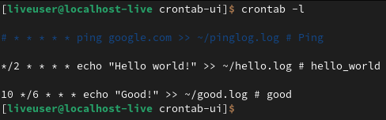
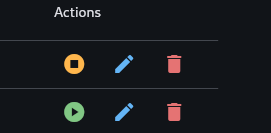

Пеерйти в: [README-EN](./README.md)

# crontab-ui

crontab-ui - это пользовательская программа с графической оболочкой, предоставляющая возможность работы с инструментом cron для автоматизации задач.




# Установка

``` bash
git clone https://github.com/Stepan-Zhnets/crontab-ui.git
```

# Запуск

Чтобы запустить проект, вам необходимо запустить скрипт `start.sh`, через команду:

``` bash
bash start.sh
```

Этот скрипт запустит установку менеджера пакетов Python UV и запустит проект, установив необходимые зависимости.

``` bash
#!/bin/bash

# Установка UV
echo "Установка UV..."
curl -sSLf https://astral.sh/uv/install.sh | sh

# Проверка на наличие UV
if ! command -v uv &>/dev/null; then
    echo "Error! UV is not set."
    exit 1
fi

# Запуск программы main.py
echo "Запуск main.py..."
uv run main.py
```

## Виды запуска программы
### Desktop

``` sh
uv run flet main.py
```

``` sh
flet run main.py
```

### Web

```sh
uv run flet --web main.py
```

``` sh
flet run --web main.py
```

# Работа с программой

## Создание работы


## Панель "действия"



### Редактирование работы


