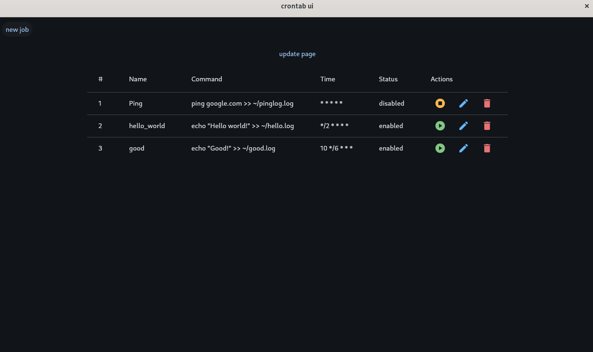
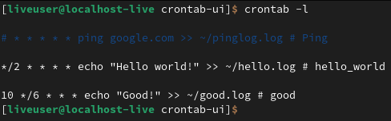
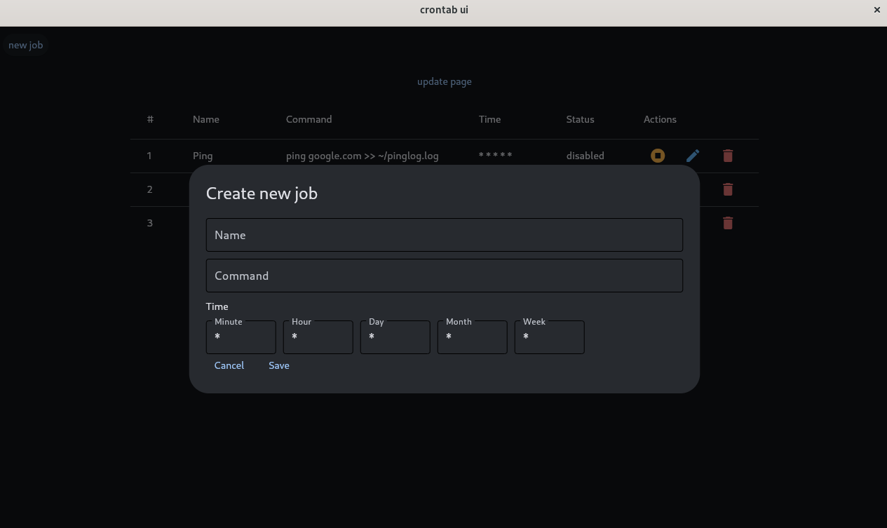
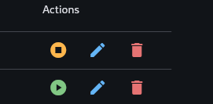
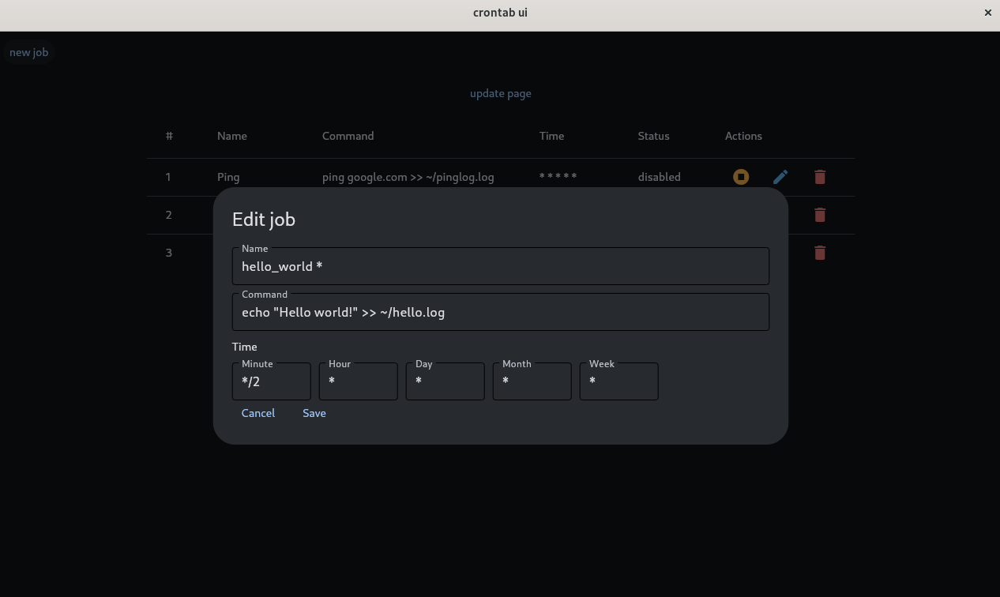

Enter in: [README-RU](./README-RU.md)

# crontab-ui

**Crontab-ui** is a user-defined program with a graphical shell that provides the ability to work with the cron tool to automate tasks.

**Cron** is a computer program (deamon) used to periodically execute tasks at a specific time. Regular actions are described by instructions placed in `crontab` files and special directories.





# Python tools

**UI: [Flet](https://flet.dev/)**


**Flet** — Is a framework that enables you to easily build real-time web, mobile, and desktop apps in your favorite language and securely share them with your team. No frontend experience is required.

---

**Tools for working with Cron: [python-crontab](https://pypi.org/project/python-crontab/#description), [croniter](https://pypi.org/project/croniter/)**


**Python-crontab** - Crontab module for reading and writing crontab files and accessing the system cron automatically and simply using a direct API.

**Croniter** - Croniter provides iteration for the datetime object with a cron like format.

---

# Installation

```bash
git clone https://github.com/Stepan-Zhnets/crontab-ui.git
```

# Launch

To run the project, you need to run the script: `start.sh `

``` bash
bash start.sh
```

This script will run the installation of the Python UV package manager and run the project, installing the necessary dependencies.

```bash
#!/bin/bash

# UV installation
echo "Installing UV..."
curl -sSLf https://astral.sh/uv/install.sh | sh

# Checking for uv
if ! command -v uv &>/dev/null; then
    echo "Error! UV is not set."
    exit 1
fi

# Program launch
main.py echo "Launch main.py ..."
uv run main.py
```

## Types of program launch
### Desktop

``` sh
uv run flet main.py
```

``` sh
flet run main.py
```

### Web

```sh
uv run flet --web main.py
```

``` sh
flet run --web main.py
```

# Working with the program

## Creating a job



## The Actions panel



### Editing a work


